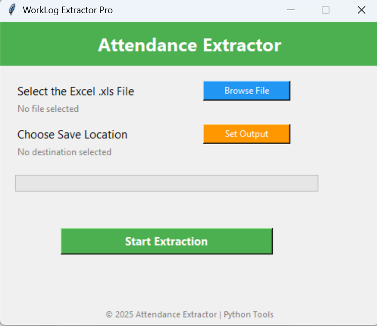

# Attendify 🕒

**Attendify** is a desktop tool to clean and extract usable attendance data from raw biometric `.xls` Excel reports. These reports often contain merged cells, unwanted headers, and unusable columns — Attendify makes them clean, structured, and ready for work!

---

### ✅ Features

- Simple GUI with no coding required
- Automatically removes unnecessary columns and headers
- Supports multi-sheet `.xls` files (biometric formats)
- Clean export to `.xlsx` format
- Progress bar and status display
- No console window – just double-click and run

---

### 📥 Installation

#### 1. Clone the repository

```bash
git clone https://github.com/yourusername/attendify.git
cd attendify

```

#### 2. Install dependencies

```bash
pip install -r requirements.txt
```

---

### 🚀 Usage

Run the app with:

```bash
python Attendify.py
```

---

### 🛠️ Build .exe File (Optional)

If you'd like to create a standalone Windows `.exe` file from the source code, you can do so using PyInstaller:

#### ✅ Steps:

1. **Install PyInstaller:**

   ```bash
   pip install pyinstaller
   ```

2. **Navigate to the project folder:**

   ```bash
   cd path/to/attendify
   ```

3. **Build the .exe:**

   ```bash
   pyinstaller --onefile --noconsole --name Attendify Attendify.py
   ```
   - `--onefile`: Packages everything into one .exe
   - `--noconsole`: Hides terminal window (for GUI)
   - `--name Attendify`: Sets output name as Attendify.exe

4. **Find your executable in the `dist/` folder:**

   ```
   Attendify/
   └── dist/
       └── Attendify.exe
   ```

💡 **Optional: Add icon (Windows only)**

```bash
pyinstaller --onefile --noconsole --name Attendify --icon=assets/app_icon.ico Attendify.py
```

---

### 🖼️ Screenshot



---

### ⚠️ Requirements

- Python 3.x
- Only `.xls` files are supported as input (not `.xlsx`).

---

### 📄 License

MIT License
